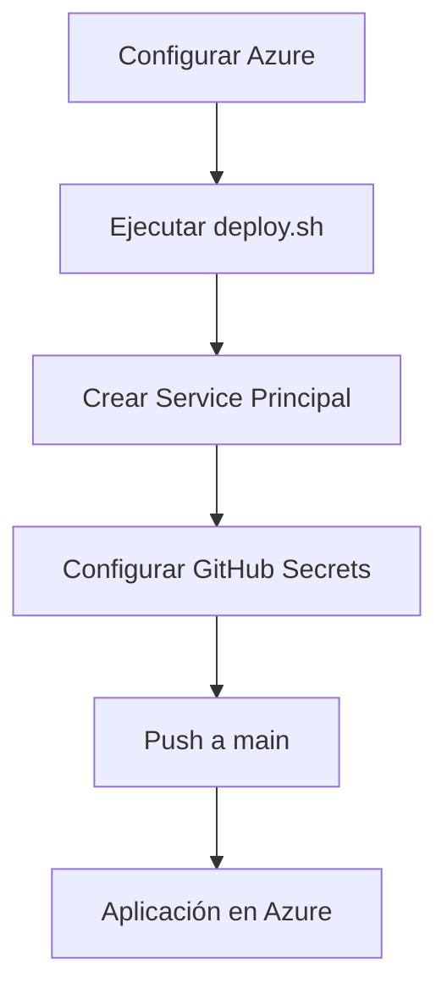
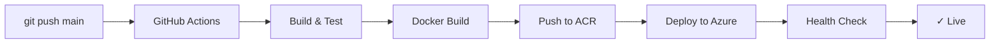

# 📦 Resumen de Implementación - Despliegue en Azure

## 🎯 Objetivo Completado

Se ha implementado un **sistema completo de despliegue en Azure** con CI/CD usando GitHub Actions para el proyecto SincoMaquinaria.

---

## ✅ Archivos Creados

### 1. Infraestructura como Código (IaC)

#### `infrastructure/azure/main.bicep`
**Propósito**: Template principal de Azure Bicep con toda la infraestructura

**Recursos definidos**:
- Azure Container Registry (ACR)
- Azure Container Apps Environment
- Azure Container App (Backend + Frontend)
- Azure Database for PostgreSQL Flexible Server (v16)
- Azure Cache for Redis (Basic C0)
- Log Analytics Workspace
- Application Insights

**Características**:
- Autoscaling (1-5 replicas)
- Health checks y probes (liveness + readiness)
- Secrets management integrado
- SSL/TLS automático
- Configuración de red segura
- Backups automáticos de PostgreSQL (7 días)

#### `infrastructure/azure/parameters.json`
**Propósito**: Parámetros de configuración para el template Bicep

**Configuración**:
- Base name: sincomaquinaria
- Environment: prod
- Location: eastus
- Replicas: 1 min, 5 max

### 2. Scripts de Despliegue

#### `infrastructure/azure/deploy.sh`
**Propósito**: Script Bash para despliegue en Linux/macOS

**Funcionalidades**:
- Validación de prerequisitos (Azure CLI, Bicep)
- Login automático en Azure
- Carga de variables desde `.env`
- Prompt interactivo para secretos
- Creación de Resource Group
- Despliegue de infraestructura con Bicep
- Obtención y display de outputs (URLs, connection strings)
- Instrucciones post-despliegue

#### `infrastructure/azure/deploy.ps1`
**Propósito**: Script PowerShell para despliegue en Windows

**Funcionalidades**: Idénticas a deploy.sh pero para Windows PowerShell

### 3. CI/CD Pipeline

#### `.github/workflows/azure-deploy.yml`
**Propósito**: Workflow de GitHub Actions para despliegue automático

**Jobs implementados**:

1. **build-and-test**
   - Setup .NET 9
   - Restore dependencies
   - Build en modo Release
   - Ejecutar tests

2. **build-and-push**
   - Login en Azure
   - Obtener credenciales del ACR
   - Build imagen Docker con Buildx
   - Push a ACR con tags (versión + latest)
   - Cache de layers con GitHub Actions cache

3. **deploy**
   - Deploy a Azure Container Apps
   - Actualización de imagen
   - Health check automático
   - Output de URL de aplicación

4. **notify**
   - Notificación de estado del despliegue

**Triggers**:
- Push a `main` o `production`
- Pull requests a `main`
- Workflow manual (workflow_dispatch)

### 4. Configuración

#### `infrastructure/azure/.env.example`
**Propósito**: Template de variables de entorno

**Variables incluidas**:
- Azure configuration (Resource Group, Location, Environment)
- Database credentials (PostgreSQL)
- JWT configuration
- Container configuration
- Security settings

#### `infrastructure/azure/.gitignore`
**Propósito**: Proteger archivos sensibles

**Archivos ignorados**:
- `.env` y variantes
- Credenciales de Azure
- Logs de despliegue
- State files

### 5. Documentación

#### `infrastructure/azure/README.md` (detallado)
**Contenido**:
- Arquitectura completa
- Prerequisitos
- Recursos de Azure
- Guía de despliegue manual paso a paso
- Configuración de GitHub Actions
- Configuración de secretos
- Monitoreo y logs
- Troubleshooting
- Estimación de costos (~$120-160/mes)
- Optimización de costos
- Actualización de infraestructura
- Backup y DR
- Referencias

#### `DEPLOYMENT.md` (guía principal)
**Contenido**:
- Resumen rápido
- Opción 1: Despliegue automático con GitHub Actions (recomendado)
- Opción 2: Despliegue manual completo
- Configuración post-despliegue
- Monitoreo
- Actualizaciones y rollbacks
- Ambientes múltiples (dev, staging, prod)
- Troubleshooting
- Checklist completo
- Mejores prácticas

#### `infrastructure/azure/QUICKSTART.md` (referencia rápida)
**Contenido**:
- Despliegue en 5 minutos
- Comandos esenciales (copy-paste ready)
- GitHub Secrets setup
- Troubleshooting rápido
- Security checklist
- URLs importantes
- Aliases útiles

---

## 🏗️ Arquitectura Implementada

```
GitHub Repository
      │
      ├─ Push to main
      │
      ▼
GitHub Actions Workflow
      │
      ├─ Build & Test (.NET 9)
      ├─ Build Docker Image
      ├─ Push to ACR
      └─ Deploy to Container Apps
      │
      ▼
Azure Container Apps
      │
      ├─ Backend (.NET 9 API)
      ├─ Frontend (React 19 SPA)
      ├─ Autoscaling (1-5 replicas)
      └─ HTTPS Ingress
      │
      ├───────────┬───────────┬──────────────┐
      ▼           ▼           ▼              ▼
PostgreSQL    Redis      App Insights   Log Analytics
Flexible      Cache      (Monitoring)   (Logging)
(Database)    (Cache)
```

---

## 🔧 Configuración de Infraestructura

### Recursos Creados

| Recurso | Nombre | SKU | Costo Mensual Aprox. |
|---------|--------|-----|----------------------|
| Container Registry | `sincomaquinariaprodacr` | Basic | $5 |
| Container App Environment | `cae-sincomaquinaria-prod` | Consumption | Incluido |
| Container App | `ca-sincomaquinaria-prod` | 1.0 vCPU, 2 GiB | $50-70 |
| PostgreSQL Server | `psql-sincomaquinaria-prod` | Standard_B2s, 32 GB | $40-50 |
| Redis Cache | `redis-sincomaquinaria-prod` | Basic C0 (250 MB) | $16 |
| Log Analytics | `log-sincomaquinaria-prod` | Pay-as-you-go | $10-20 |
| Application Insights | `ai-sincomaquinaria-prod` | - | Incluido |
| **TOTAL** | | | **$120-160/mes** |

### Características de Seguridad

✅ **SSL/TLS**: HTTPS automático en Container Apps
✅ **Secrets Management**: Azure Container App Secrets
✅ **PostgreSQL**: SSL requerido, TLS 1.2+
✅ **Redis**: SSL habilitado, TLS 1.2+
✅ **Firewall**: PostgreSQL con regla para Azure Services
✅ **No públicos**: Redis y PostgreSQL no expuestos públicamente
✅ **Authentication**: JWT con refresh tokens (15 min + 7 días)

### Características de Observabilidad

✅ **Application Insights**: Métricas, traces, y exceptions
✅ **Log Analytics**: Logs centralizados y queries
✅ **Container Logs**: Streaming en tiempo real
✅ **Health Checks**: Liveness y Readiness probes
✅ **Hangfire Dashboard**: Monitoreo de background jobs

---

## 🚀 Flujo de Despliegue

### Despliegue Inicial (Una sola vez)



**Tiempo estimado**: 20-30 minutos

### Despliegues Posteriores (Automáticos)



**Tiempo estimado**: 5-10 minutos

---

## 📊 Variables de Entorno Configuradas

### En Azure Container App

Configuradas automáticamente por el template Bicep:

```bash
ASPNETCORE_ENVIRONMENT=Production
ASPNETCORE_URLS=http://+:5000

# Database
ConnectionStrings__DefaultConnection=<from secret>

# Redis
ConnectionStrings__Redis=<from secret>

# JWT
Jwt__Key=<from secret>
Jwt__Issuer=SincoMaquinaria
Jwt__Audience=SincoMaquinariaApp
Jwt__ExpirationMinutes=15
Jwt__RefreshTokenExpirationDays=7

# Caching
Caching__Enabled=true

# Hangfire
Hangfire__DashboardEnabled=true
Hangfire__ServerName=SincoMaquinaria-Azure
Hangfire__WorkerCount=5

# Security
Security__MaxFileUploadSizeMB=50

# Monitoring
APPLICATIONINSIGHTS_CONNECTION_STRING=<auto>
```

### Secrets Configurados

Los siguientes secrets están configurados en Azure Container App:

- `acr-password`: Password del Container Registry
- `postgres-connection`: Connection string de PostgreSQL
- `redis-connection`: Connection string de Redis
- `jwt-key`: Clave secreta JWT
- `app-insights-key`: Instrumentation key de App Insights

---

## 🔑 GitHub Secrets Requeridos

Para que el workflow funcione, configurar en GitHub:

| Secret | Descripción | Dónde obtenerlo |
|--------|-------------|-----------------|
| `AZURE_CREDENTIALS` | Service Principal JSON | `az ad sp create-for-rbac --sdk-auth` |
| `POSTGRES_ADMIN_PASSWORD` | Password de PostgreSQL | Definido por ti |
| `JWT_SECRET_KEY` | Clave JWT (32+ chars) | `openssl rand -base64 32` |

---

## 🎛️ Endpoints Disponibles

Una vez desplegado, los siguientes endpoints estarán disponibles:

| Endpoint | URL | Descripción |
|----------|-----|-------------|
| **Aplicación Principal** | `https://ca-sincomaquinaria-prod.*.azurecontainerapps.io` | SPA React + API |
| **API Health Check** | `https://...azurecontainerapps.io/health` | Health status |
| **Swagger UI** | `https://...azurecontainerapps.io/swagger` | API documentation |
| **Hangfire Dashboard** | `https://...azurecontainerapps.io/hangfire` | Background jobs (Admin only) |
| **SignalR Hub** | `wss://...azurecontainerapps.io/dashboard-hub` | Real-time dashboard |

---

## 📈 Monitoreo y Alertas

### Application Insights

**Métricas automáticas**:
- Request rate y response times
- Dependency calls (PostgreSQL, Redis)
- Exceptions y errors
- Custom events

**Queries útiles**:

```kusto
// Top 10 requests más lentos
requests
| where timestamp > ago(1h)
| top 10 by duration desc
| project timestamp, name, duration, resultCode

// Errores recientes
exceptions
| where timestamp > ago(24h)
| project timestamp, type, outerMessage
| order by timestamp desc
```

### Log Analytics

**Logs disponibles**:
- Container App console logs
- System logs
- Ingress logs

---

## 🔄 Operaciones Comunes

### Ver Logs

```bash
az containerapp logs show \
  --name ca-sincomaquinaria-prod \
  --resource-group rg-sincomaquinaria-prod \
  --follow
```

### Escalar Manualmente

```bash
az containerapp update \
  --name ca-sincomaquinaria-prod \
  --resource-group rg-sincomaquinaria-prod \
  --min-replicas 2 \
  --max-replicas 10
```

### Rollback

```bash
# Listar revisiones
az containerapp revision list \
  --name ca-sincomaquinaria-prod \
  --resource-group rg-sincomaquinaria-prod

# Activar revisión anterior
az containerapp revision activate \
  --revision <nombre> \
  --name ca-sincomaquinaria-prod \
  --resource-group rg-sincomaquinaria-prod
```

### Reiniciar Aplicación

```bash
az containerapp revision restart \
  --name ca-sincomaquinaria-prod \
  --resource-group rg-sincomaquinaria-prod
```

---

## ✨ Características Implementadas

### En el Despliegue

- ✅ **Infraestructura como Código**: Bicep templates versionados
- ✅ **CI/CD Automático**: GitHub Actions con 4 jobs
- ✅ **Autoscaling**: Basado en CPU/memoria y HTTP requests
- ✅ **Zero-downtime deployments**: Rolling updates
- ✅ **Health checks**: Liveness y readiness probes
- ✅ **Secrets management**: Azure Container App secrets
- ✅ **Logging centralizado**: Log Analytics
- ✅ **Monitoring**: Application Insights
- ✅ **Backups automáticos**: PostgreSQL (7 días)
- ✅ **SSL/TLS**: HTTPS automático

### En la Aplicación

- ✅ **Backend**: .NET 9 con Minimal APIs
- ✅ **Frontend**: React 19 SPA (servido por backend)
- ✅ **Database**: PostgreSQL 16 con Event Sourcing (Marten)
- ✅ **Cache**: Redis distribuido
- ✅ **Background Jobs**: Hangfire con PostgreSQL storage
- ✅ **Authentication**: JWT con refresh tokens
- ✅ **Real-time**: SignalR para dashboard
- ✅ **API Documentation**: Swagger/OpenAPI

---

## 🎓 Próximos Pasos Recomendados

### Post-Despliegue

1. **Configurar dominio personalizado**
   ```bash
   az containerapp hostname add \
     --hostname www.sincomaquinaria.com \
     --name ca-sincomaquinaria-prod \
     --resource-group rg-sincomaquinaria-prod
   ```

2. **Configurar alertas en Application Insights**
   - Alertas de disponibilidad
   - Alertas de performance
   - Alertas de errores

3. **Habilitar geo-redundancia para PostgreSQL** (producción)
   ```bash
   az postgres flexible-server update \
     --name psql-sincomaquinaria-prod \
     --resource-group rg-sincomaquinaria-prod \
     --geo-redundant-backup Enabled
   ```

4. **Configurar ambientes adicionales** (staging, dev)
   ```bash
   ENVIRONMENT=staging ./deploy.sh
   ```

5. **Configurar Azure Front Door** (opcional, para CDN global)

### Mejoras Futuras

- [ ] Implementar Azure Key Vault para secrets management
- [ ] Configurar Azure Monitor alerts y action groups
- [ ] Implementar disaster recovery plan documentado
- [ ] Configurar Azure DevOps Boards para tracking
- [ ] Implementar feature flags
- [ ] Configurar Content Delivery Network (CDN)
- [ ] Implementar API rate limiting
- [ ] Configurar Web Application Firewall (WAF)

---

## 📚 Documentación Relacionada

| Documento | Propósito | Audiencia |
|-----------|-----------|-----------|
| `infrastructure/azure/README.md` | Documentación técnica completa | DevOps, Developers |
| `DEPLOYMENT.md` | Guía paso a paso de despliegue | DevOps, Developers |
| `infrastructure/azure/QUICKSTART.md` | Referencia rápida de comandos | DevOps |
| `infrastructure/azure/main.bicep` | Infraestructura como código | DevOps, Cloud Engineers |
| `.github/workflows/azure-deploy.yml` | Pipeline CI/CD | DevOps |

---

## 🎉 Conclusión

Se ha implementado exitosamente un **sistema de despliegue enterprise-grade en Azure** con:

- ✅ Infraestructura completamente automatizada (IaC)
- ✅ CI/CD con GitHub Actions
- ✅ Monitoreo y observabilidad completos
- ✅ Seguridad enterprise (secrets, SSL, firewall)
- ✅ Alta disponibilidad y autoscaling
- ✅ Documentación completa
- ✅ Costos optimizados (~$120-160/mes)

**El proyecto está listo para producción** y puede escalarse según las necesidades del negocio.

---

**Creado**: 2026-02-06
**Última actualización**: 2026-02-06
**Versión**: 1.0.0
